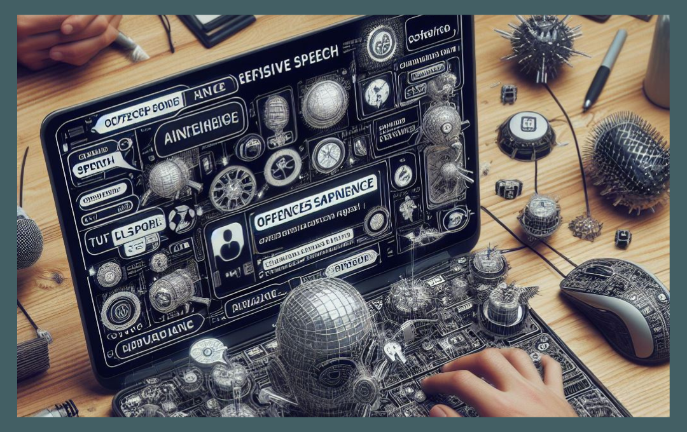
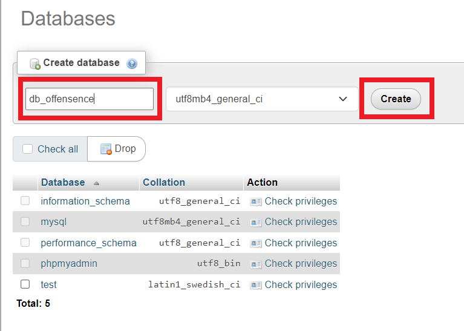
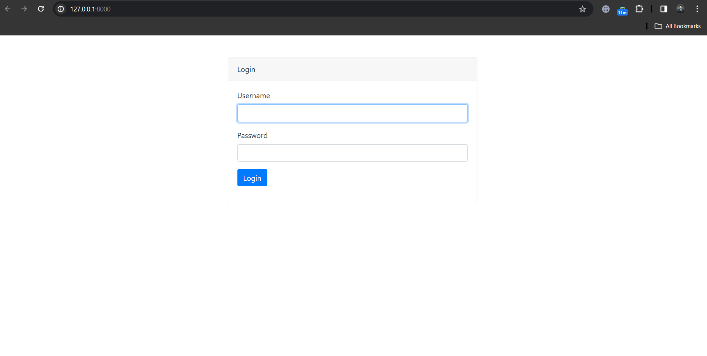
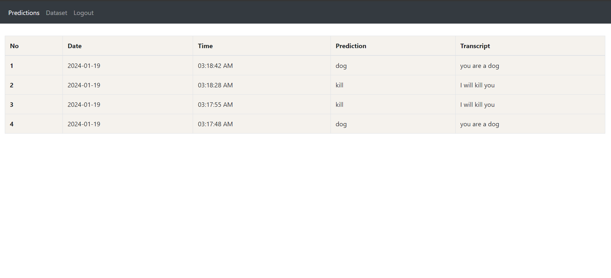
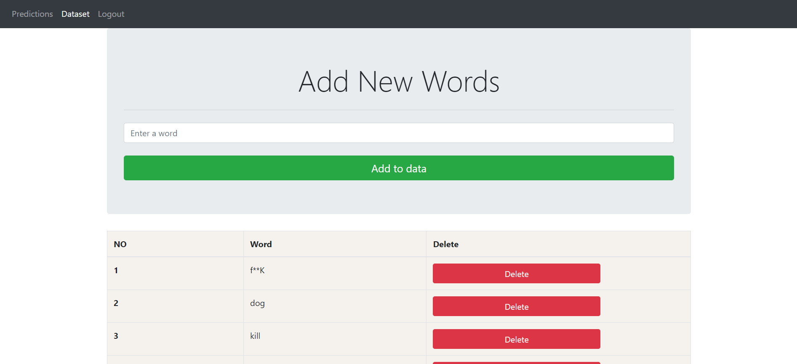
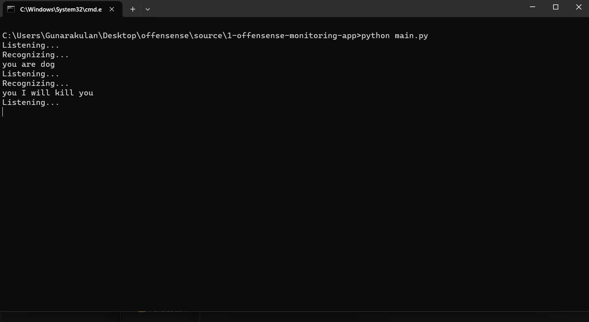

# Offensence

## Repo Structure

```
    ├── docs                                   # Contains documents.
    ├── research                               # Contains pre-research experiments.
    ├── source                                 # Contains project source code.
    │   ├── 0-offensense-management-app            # Contains management app's source code.
    │   ├── 1-offensense-monitoring-app            # Contains monitoring app's source code.
    └── README.MD                              # Readme Content.
    └── LICENCE                                # Licence
```

## Introduction

An AI-powered real-time speech analyzer has been developed to identify and manage offensive language during live conversations. This advanced system consists of two essential components: the Management App and the Monitoring App. 

The Management App is the nerve center, providing a user-friendly interface to evaluate detection data, administer corrective actions, and seamlessly incorporate new offensive language patterns. The Management App constantly analyzes real-time audio streams to identify swiftly and flag instances of offensive language.  

This innovative solution enhances the efficiency of moderating live interactions and offers a comprehensive and adaptive approach to addressing evolving linguistic nuances. 



## 02 Technology Stack

### 2.1 Management App (Web App)

 - Laravel (v8.83.27)
 - PHP (v8.2.0)
 - MySQL
 - Composer

### 2.2 Monitoring App (Desktop App)

 - Python 3.8.5 (Recommended)
 - SpeechRecognition
 - PyAudio
 - MySQLConnector


## 03 Setup

### 3.1 Setup Management App

- **Step 01:** Create a MySQL database

  ```
  Database Name: db_offensence
  ```
  
  

- **Step 02:** Install Composer

  ```
    Download Link: getcomposer.org
  ```

- **Step 03:** Navigate to the following directory

  ```
    offensense\source\0-offensense-management-app
  ```

- **Step 04:** Install Laravel using Composer: Run the following command.

  ```
    composer install
  ```


- **Step 05:** Migrate the database: Run the following command.

  ```
    php artisan migrate
  ```

- **Step 06:** Launch the app: Run the following command.

  ```
    php artisan serve
  ```

### 3.2 Update PHP Version (Optional)

**Note:** The PHP version needs to be matched with Laravel; the recommended PHP version is 8.2.0; if you are using newer or old PHP, it is essential to update Laravel accordingly. 

- **Step 01:** Edit the composer.json: 

  ```
    "require": {
        "php": "^8.2.0",
        // other dependencies...
    },
  ```

- **Step 02:** Update the Laravel with new PHP verion:  

  ```
    composer update
  ```
  **Note:** This command will download the Laravel that matches the given PHP version.

- **Step 03:** Generate the Composer autoload files.

  ```
    composer dump-autoload
  ```

- **Step 04:** Clear the configuration cache.

  ```
    php artisan config:clear
  ```

- **Step 05:** Launch the app

  ```
    php artisan serve
  ```

### 3.3 Configure Database (Optional)

- **Step 05:** Edit the .env file

  ```
    DB_CONNECTION=mysql
    DB_HOST=127.0.0.1
    DB_PORT=3306
    DB_DATABASE='db_offensence'
    DB_USERNAME=root
    DB_PASSWORD=
  ```

### 3.4 Setup Monitoring App

- **Step 01:** Install Python (v3.8.5 Recommended)

  ```
    Download Link: python.org
  ```

- **Step 02:** Navigate to the following directory.

  ```
    offensense/docs/requirements.txt
  ```

- **Step 03:** Install dependencies | Run the following command

  ```
    pip install -r requirements.txt
  ```

 **Note:** This will install all the required dependencies.

## 04 Usage

### 4.1 Management App

#### 4.1.1 Login Screen

  


| Username | Password |
|----------|----------|
| admin    | admin    |


#### 4.1.2 Dashboard Screen
  
  


#### 4.1.3 Dataset Screen
  
  

### 4.2 Monitoring App

- **Step 01:** Navigate to the following directory.

  ```
    offensense\source\1-offensense-monitoring-app
  ```


- **Step 02:** Run the app.

  ```
    python main.py
  ```

  


# CONTACT

### Website: 

[](http://www.gunarakulan.info)

### Social Media:

[](https://www.linkedin.com/in/gunarakulangunaretnam)
[](https://www.facebook.com/gunarakulangunaretnam)
[](https://wa.me/94740001141?text=WhatsApp%3A%20%2B9740001141)
[](https://www.instagram.com/gunarakulangunaretnam)
[](https://x.com/gunarakulangr)
[](https://www.kaggle.com/gunarakulangr)
[](https://www.tiktok.com/@gunarakulangunaretnam)
[](https://www.youtube.com/channel/UCjMOdgHFAjAdBKiqV8y2Tww)
